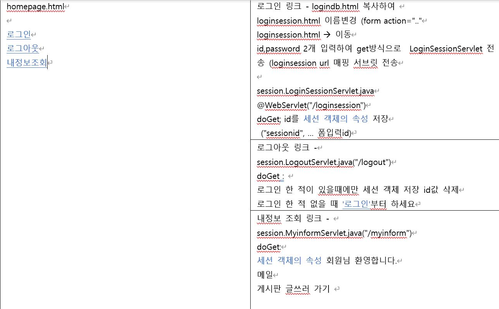
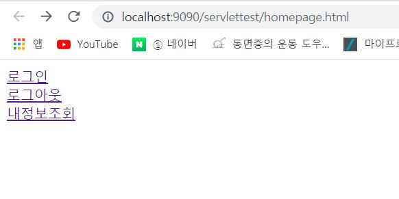
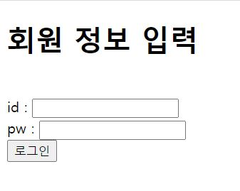
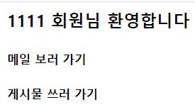

# 홈화면 만들기 실습




## 메인페이지 

```javascript
<!DOCTYPE html>
<html>
<head>

<meta charset="UTF-8">
<title>Insert title here</title>

</head>
<body>
<a href="loginsession.html" name = 로그인>로그인</a> <br>
<a href="logout" >로그아웃</a> <br>
<a href="myinform" >내정보조회</a>
</body>
</html>
```



## 로그인세션 

```javascript
<!DOCTYPE html>
<html>
<head>
<meta charset="UTF-8">
<title>Insert title here</title>
</head>
<body>
<h1>회원 정보 입력</h1><br>
<form action= "loginsession" > 
id : <input type=text name="id" ><br>
pw : <input type="password" name=password> <br>
	<input type=submit value="로그인">
</form>
</body>
</html>
```



## 로그인 세션

```javascript
package session;

import java.io.IOException;
import java.io.PrintWriter;

import javax.servlet.ServletException;
import javax.servlet.annotation.WebServlet;
import javax.servlet.http.HttpServlet;
import javax.servlet.http.HttpServletRequest;
import javax.servlet.http.HttpServletResponse;
import javax.servlet.http.HttpSession;


@WebServlet("/loginsession")
public class LoginSessionServlet extends HttpServlet {

	protected void doGet(HttpServletRequest request, HttpServletResponse response) throws ServletException, IOException {
		/*	내가 한것
        request.setCharacterEncoding("utf-8");				
		String id =request.getParameter("id");
		String pw =request.getParameter("password");
		session.setAttribute("id", id);
		response.setContentType("text/html;charset=utf-8");
		PrintWriter out = response.getWriter();
		out.println("서버에 세션 정보를 저장했습니다.");
		*/ 
						
						//강사님이 한것
		HttpSession session = request.getSession();
		if(session.getAttribute("sessionid") ==null) {
		session.setAttribute("sessionid", request.getParameter("id"));
		}
		response.setContentType("text/html;charset=utf-8");
		PrintWriter out = response.getWriter();
		out.println("<h1>로그인 했습니다.</h1>");
	}
}
```


> * 강사님것
>   * HttpSession session = request.getSession(); 으로 Session 선언을 한뒤
>   * if(session.getAttribute("sessionid") ==null) <-- **sessionid 가 없으면**  다음 메소드를 실행한다
>   * session.setAttribute("sessionid", request.getParameter("id")); 입력값으로 받은 **"id"를** 세션에 **"sessionid"** 이름으로 지정하여 저장한다.
>   *  response. ~~ out.println("<h1>로그인 했습니다.</h1>"); 을  이용하여 화면에 출력
>   
>   
>   
> * 내가한것
>
>   * 단순히 입력 파라미터를 받아와  session.setAttribute("id", id); 을 이용해 "id" 이름을 가진 id로 저장


## 로그아웃 

```javascript
package session;

import java.io.IOException;
import java.io.PrintWriter;

import javax.servlet.ServletException;
import javax.servlet.annotation.WebServlet;
import javax.servlet.http.HttpServlet;
import javax.servlet.http.HttpServletRequest;
import javax.servlet.http.HttpServletResponse;
import javax.servlet.http.HttpSession;


@WebServlet("/logout")
public class LogoutServlet extends HttpServlet {
	protected void doGet(HttpServletRequest request, HttpServletResponse response) throws ServletException, IOException {
		/* 내가 한거
		  HttpSession session = request.getSession(); 
		  if(session.getAttribute("id") != null){
          session.removeAttribute("id"); 
          } else {
		  response.setContentType("text/html;charset=utf-8"); 
		  PrintWriter out = response.getWriter(); 
		  out.println("<a href:loginsession.html> 로그인" + " 부터 하세요 </a> ");
		  }
		 */
        
        
    //강사님것
    HttpSession session = request.getSession();
	//if(session.isNew() ==null ); 만약새로 생성한 세션이 null이면 ->이전값이 없으면,
	//if(session ==null); 세션이 null이면 -> 이전값 없으면,
	String result=  " ";
	if(session.getAttribute("sessionid") != null) {
	//로그인 한적 있다.
	session.removeAttribute("sessionid");
	result = "<h1>정상적으로 로그아웃되었습니다</h1>" ;
	}else {
	result = "<h1> <a href=\"loginsession.html\"> 로그인</a> 하세요</h1>";
			}
	response.setContentType("text/html;charset=utf-8");
	PrintWriter o = response.getWriter();
	o.println(result);								
	}

}
```

#### 세션값 있을때:


#### 세션값 없을때: 


> * 강사님것 
>   * HttpSession session = request.getSession(); 으로 전달받은 세션을 가져온다.
>   * String result=  " "; 을 사용해 미리 result 객체 생성
>   * if(session.getAttribute("sessionid") != null) "sessionid"가 null이 아니다 -> **로그인한적이 있다면**
>   * session.removeAttribute("sessionid"); "sessionid"값을 삭제
>   * result = "<h1>정상적으로 로그아웃되었습니다</h1>" ; result를 화면에 출력
>   * else구문으로 **로그인한적 없다면**
>   * result = "<h1> <a href=\"loginsession.html\"> 로그인</a> 하세요</h1>"; 으로 로그인 세션으로 이동하는 문장 생성
>
> 
>
> * 내가한것
>   * HttpSession session = request.getSession();  세션값 받아온다
>   
>   * if(session.getAttribute("id") != null) 세션값의 "id" 가 null이 아니라면 ->**로그인한적 있다면** 
>   
>   * session.removeAttribute("id"); "id"값 삭제
>   
>   * else구문으로 **로그인 한적 없다면**
>   
>   * PrintWriter out = response.getWriter();  out 객체 생성하여 
>   
>   * out.println('<a href:loginsession_ntml> 로그인" + " 부터 하세요 </a> ");
>   
>     -->로그인 세션 이동하는 문장 생성

## 회원정보 

```javascript
package session;

import java.io.IOException;
import java.io.PrintWriter;

import javax.servlet.ServletException;
import javax.servlet.annotation.WebServlet;
import javax.servlet.http.HttpServlet;
import javax.servlet.http.HttpServletRequest;
import javax.servlet.http.HttpServletResponse;
import javax.servlet.http.HttpSession;

@WebServlet("/myinform")
public class MyInformServlet extends HttpServlet {
	
	protected void doGet(HttpServletRequest request, HttpServletResponse response) throws ServletException, IOException {
	/* 내가 한것
	 String id = (String)session.getAttribute("id");
	response.setContentType("text/html;charset=utf-8"); //브라우저 표시 한글 인코딩 
	PrintWriter out = response.getWriter();
	out.println(id + "회원님 환영합니다.");
	out.print("메일보러가기");
	out.print("게시판 글쓰러 가기 ");
	*/
        
	HttpSession session = request.getSession();
	String result ="";
	if(session.getAttribute("sessionid") !=null) {
	result= "<h3>" + session.getAttribute("sessionid") + " 회원님 환영합니다</h3>";
	result+= "<h5> 메일 보러 가기 </h5> ";
	result+= "<h5> 게시물 쓰러 가기 </h5>";
	} else {
	result= "<h1><a href='loginsession.html'> 로그인</a>  부터 하세요</h1>";
			}
	response.setContentType("text/html;charset=utf-8");
	PrintWriter o = response.getWriter();
	o.println(result);						
	}

}
```

#### 세션 있을때: 



#### 세션 없을때: 


> * 강사님것
>
>   * HttpSession session = request.getSession(); 세션값 받아온다
>
>   * String result =""; result 객체 생성
>
>   * if(session.getAttribute("sessionid") !=null)  "sessionid"가 null이 아니라면-> **세션이 있다면**
>
>   * result= "<h3>" + session.getAttribute("sessionid") + " 회원님 환영합니다</h3>";
>     	result+= "<h5> 메일 보러 가기 </h5> ";
>     	result+= "<h5> 게시물 쓰러 가기 </h5>";
>
>     --> result로 화면에 출력되게 하고, session.getAttribute("sessionid") 으로 "sessionid"에 저장된 값을 화면에 읽어온다
>
>   * else구문으로 **세션이 없을때** 생성
>
>   * result= "<h1><a href='loginsession_ntmI'> 로그인</a>  부터 하세요</h1>"; 생성

> * 내가 한것
>
>   * String id = (String)session.getAttribute("id"); session에 저장된 "id"값을 id객체에 저장한다.
>   * out.println(id + "회원님 환영합니다.");
>     	out.print("메일보러가기");
>     	out.print("게시판 글쓰러 가기 ");
>
>   --> 화면에 id값과 내용이 출력되게 한다.


### 강사님 답안과 비교

> * 나는 단순히 parameter값을 session에 저장해 불러왔는데, 
>
>   * 강사님은 처음에 HttpSession session = request.getSession();  을 사용하여 저장된 session값을 객체로 불러왔다.
>
> * 나는 if(session.getAttribute("id") != null)  구문이 단순했는데
>
>   * 강사님은 로그인 화면에서  if(session.getAttribute("sessionid") ==null) 을 사용해 이전 세션에 저장된 값이 없을때 저장되도록 했고
>
>   *  if(session.getAttribute("sessionid") !=null) 을 사용하여 세션에 확실히 저장된 값이 있을때 출력되도록 설정하였다.
>
>   * session.setAttribute("sessionid", request.getParameter("id")); 으로 한문장으로 세션에 이름과 
>
>     object를 설정했다.


## 기억나는것 

* Session을 사용할땐  HttpSession session = request.getSession();   을 사용하여 불러온다.

* if(session.getAttribute("sessionid") ==null) 이전에 저장된 세션값이 없다면

* if(session.getAttribute("sessionid") !=null) 이전에 저장된 세션값이 있다면

* String result = " "; 로 result 객체를 미리 선언한뒤, html태그를 사용하여 출력할때 사용한다.

* 	response.setContentType("text/html;charset=utf-8");
  	PrintWriter o = response.getWriter();
  	o.println(result);

구문은 항상 사용하고, 출력될때 쓰는내용인데 출력 할 result 내용을 다 입력한뒤,

마지막에 입력한다. 안그럼 아무런 화면도 안뜬다
