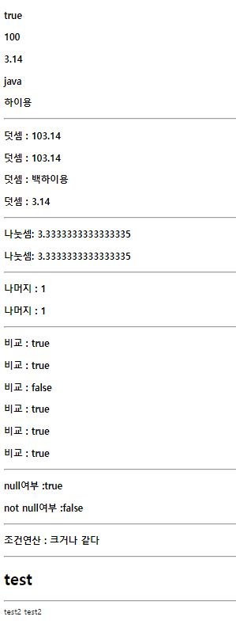

# el 표현언어

### eltest1.jsp

```javascript
<%@ page language="java" contentType="text/html; charset=UTF-8"
    pageEncoding="UTF-8" isELIgnored=false  %>
<!DOCTYPE html>
<html>
<head>
<meta charset="UTF-8">
<title>Insert title here</title>

</head>
<body>
<h3> ${i= true }</h3>
<h3> ${i2= 100 }</h3>
<h3> ${i3= 3.14 }</h3>
<h3> ${i4= 'java' }</h3>
<h3> ${i5= "하이용" }</h3>
<h3> ${i6= null }</h3>
<hr>
<h3> 덧셈 : ${i2 + i3}</h3>
<h3> 덧셈 : ${"100" + i3}</h3> <!--""내부 0~9까지 숫자들 자동형변환됨 "100" =100 -->
<%-- <h3> 덧셈 : ${"one" + i3}</h3> --%> <!-- 오류 -->
<h3> 덧셈 : ${"백" += i5}</h3> <!-- +=을 사용해서 연산자 결합 -->
<h3> 덧셈 : ${i6 + i3}</h3> <!-- null 자동으로 0으로 변경 -->
<hr>
<h3>나눗셈: ${10/3 }</h3>
<h3>나눗셈: ${10 div 3 }</h3> <!-- 에러 아님 -->
<hr>
<h3>나머지 : ${10 % 3 }</h3>
<h3>나머지 : ${10 mod 3 }</h3> 
<hr>
<h3>비교 : ${10 != 3 }</h3> 
<h3>비교 : ${10 ne 3 }</h3> 
<h3>비교 : ${10 == 3 }</h3> 
<h3>비교 : ${10 >= 3 }</h3> 
<h3>비교 : ${10 gt 3 }</h3> 
<h3>비교 : ${10 ge 3 }</h3> 
<hr>
<h3>null여부 :${empty i6 }</h3> <!-- i6=null; 여부 묻는 것 -->
<h3>not null여부 :${!empty i6 }</h3>
<hr>
<h3> 조건연산 : ${20 >= 20? "크거나 같다" : "작다" }</h3> <!-- { a>=b? "": "" } -->


<hr>
<!-- jsp 변수를 el 전달 -->
<%
String s = "test";
pageContext.setAttribute("j", s ) ; 
//'현재' jsp가 el로 전송는 j라는 데이터값 s= "test" 를 보내겟다. el은 jsp 태그와 별도로 써야 한다
//request.setAttribute("j", s ) ; //forward 나 includ 하고있는 다른 jsp와 공유하겠다
//session.setAttribute("j", s ) ; //현재 브라우저 실행 다른 jps공유
%>
<!-- el 이 전달받자 -->
<h1>${pageScope.j}</h1>
<hr>
<!-- el 변수를 jsp로 전달하자 -->
${ me = "test2"  }

<!-- set보낼때, get 받을때! -->
<%=pageContext.getAttribute("me") %>

</body>
</html>
```



> * 기존 표현식보다 편리하게 값을 출력한다.
> * 변수와 여러 가지 연산자를 포함할 수 있다.
>   * +|-|/|* 사칙연산, %
>   * div, mod(나머지), 비교 (!=, ne , == , >=, gt, ge)
>   * null: ${empty}  ,not null:${!empty}
>   * 조건연산 { a>=b? "": "" } ex) ${20 >= 20? "크거나 같다" : "작다" }
> * 표현언어 자체 내장 객체도 제공
>   * 내부 0~9까지 숫자들 자동형변환됨  ex) "100" = 100
>   * +=을 사용해서 연산자 결합  ex) "백" += i5 = 백하이용
> * 선언부에서 isELIgnored=false 를 선언해 사용해야한다.
> * jsp 변수를 el 전달
>   * String s = "test";
>     pageContext.setAttribute("j", s ) ;
>   * ${pageScope.j} ==>test
> *  el 변수를 jsp로 전달하자
>   * ${ me = "test2"  }
>   * <%=pageContext.getAttribute("me") %> ==> test2


> * pageContext.setAttribute("j", s ) ;  ==>  **현재 페이지**에서 j에 s를 저장
> * request.setAttribute("j", s ) ; ==> **forward 나 includ** 하고있는 다른 jsp와 공유하겠다
> * session.setAttribute("j", s ) ; ==> **session에 저장**하여 현재 브라우저 실행, 다른 jps공유


