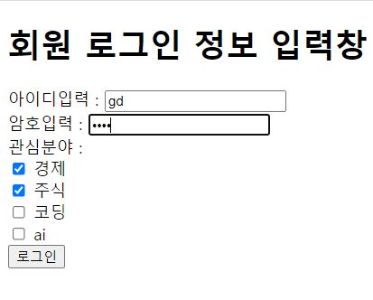
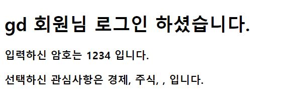
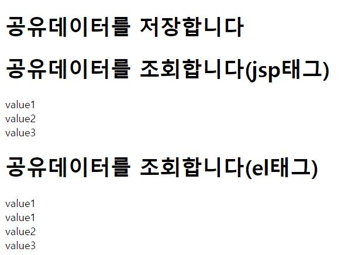
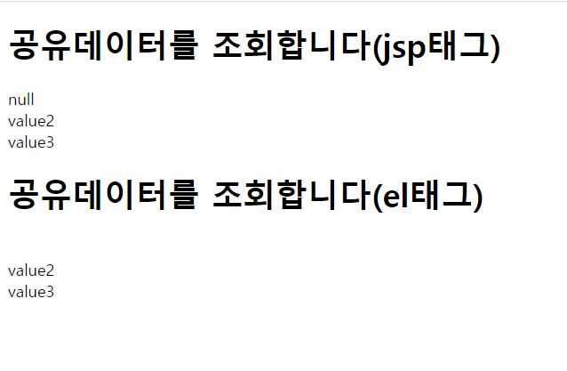
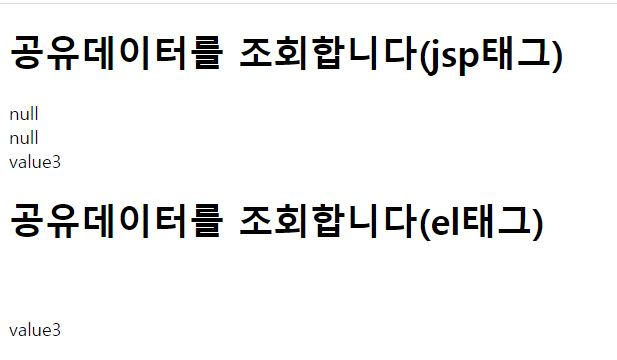

# el표현언어2

#### el_loginform.html

```javascript
<!DOCTYPE html>
<html>
<head>
<meta charset="UTF-8">
<title>Insert title here</title>

</head>
<body>
<h1>회원 로그인 정보 입력창</h1>

<form action="el_loginprocess.jsp" method="post">
	아이디입력 : <input type=text name="id"><br> <!-- name속성은  입력파라미터 -->
	암호입력 : <input type=password name="pw" ><br>
	관심분야 : <br>
	<input type="checkbox" name="con" value="경제"> 경제 <br>
	<input type="checkbox" name="con" value="주식"> 주식 <br>
	<input type="checkbox" name="con" value="코딩"> 코딩 <br>
	<input type="checkbox" name="con" value="ai"> ai <br>
	<input type=submit value="로그인">
</form>
</body>
</html>

```



#### el_loginprocess.jsp

```javascript
<%@ page language="java" contentType="text/html; charset=UTF-8"
    pageEncoding="UTF-8"%>
<!DOCTYPE html>
<html>
<head>
<meta charset="UTF-8">
<title>Insert title here</title>
<script src="jquery-3.2.1.min.js"></script>
<script>
$(document).ready(function() { 

});
</script>
</head>
<body>
<% 
request.setCharacterEncoding("utf-8");

%>
<h1>${param.id  } 회원님 로그인 하셨습니다.</h1>
<h3>입력하신 암호는 ${param.pw } 입니다.</h3>
<h3>선택하신 관심사항은 ${paramValues.con[0] }, ${paramValues.con[1] },  ${paramValues.con[2] },  ${paramValues.con[3] } 입니다. </h3>
<!-- 선택하지 않은 null 데이터는 화면에서 공백으로 처리  -->

</body>
</html>
```



> * ${param.id  } 로 name이 id parameter값을 간단하게 출력
> * ${paramValues.con[0] } 로 checkbox 같은 동일name(=con) values을  배열대로 화면에 출력
> * 선택하지 않은 null 데이터는 화면에서 공백으로 처리


#### el_test2.jsp

```javascript
<%@ page language="java" contentType="text/html; charset=UTF-8"
    pageEncoding="UTF-8"%>
<!DOCTYPE html>
<html>
<head>
<meta charset="UTF-8">
<title>Insert title here</title>
<script src="jquery-3.2.1.min.js"></script>
<script>
$(document).ready(function() { 


});
</script>
</head>
<body>
<h1> 공유데이터를 저장합니다 </h1>
<%
pageContext.setAttribute("data1", "value1");
request.setAttribute("data2", "value2");
session.setAttribute("data3", "value3");
%>

<h1> 공유데이터를 조회합니다(jsp태그) </h1>
<%=pageContext.getAttribute("data1") %><br>
<%=request.getAttribute("data2") %><br>
<%=session.getAttribute("data3") %><br>

<h1> 공유데이터를 조회합니다(el태그) </h1>
${data1}<br>
${pageScope.data1 }<br>
${requestScope.data2 }<br>
${sessionScope.data3 }

 <jsp:forward page="el_test3.jsp" />

</body>
</html>
```

#### <jsp:forward page="el_test3.jsp" />  forward 비활성화

 

> * setAttribute를 통해 page, request, session 에 데이터와 벨류를 저장한다.
>
> 
>
> * jps 태그로 조회 (**page, request , session + getAttribute()**  )
>    * <%=pageContext.getAttribute("data1") %>
>    * <%=request.getAttribute("data2") %>
>    * <%=session.getAttribute("data3") %>
>
> 
>
> * el 태그로 조회 (**pageScope, requestScope,sessionScope** )
> 	* ${data1}  =  ${pageScope.data1 }
>   * ${requestScope.data2 }
>   * ${sessionScope.data3 }


####  <jsp:forward page="el_test3.jsp" />  forward 활성화



> * forward하게되면  **request와 session에만 데이터가 저장**되고 page의 저장값을 읽을 수 없으므로 null로 표기 된다.


#### el_test3.jsp

```javascript
<%@ page language="java" contentType="text/html; charset=UTF-8"
    pageEncoding="UTF-8"%>
<!DOCTYPE html>
<html>
<head>
<meta charset="UTF-8">
<title>Insert title here</title>
<script src="jquery-3.2.1.min.js"></script>
<script>
$(document).ready(function() { 
});
</script>
</head>
<body>

<h1> 공유데이터를 조회합니다(jsp태그) </h1>
<%=pageContext.getAttribute("data1") %><br><!-- 현재 페이지에서만 공유한다 -->
<%=request.getAttribute("data2") %><br>
<%=session.getAttribute("data3") %><br>

<h1> 공유데이터를 조회합니다(el태그) </h1>
${pageScope.data1 }<br>
${requestScope.data2 }<br>
${sessionScope.data3 }

</body>
</html>
```



> * el_test3.jsp 만 실행하게 되면 **브라우저에 저장된 session으로 인해** data3 값만 읽을수 있고 나머지는 null로 표기된다.


