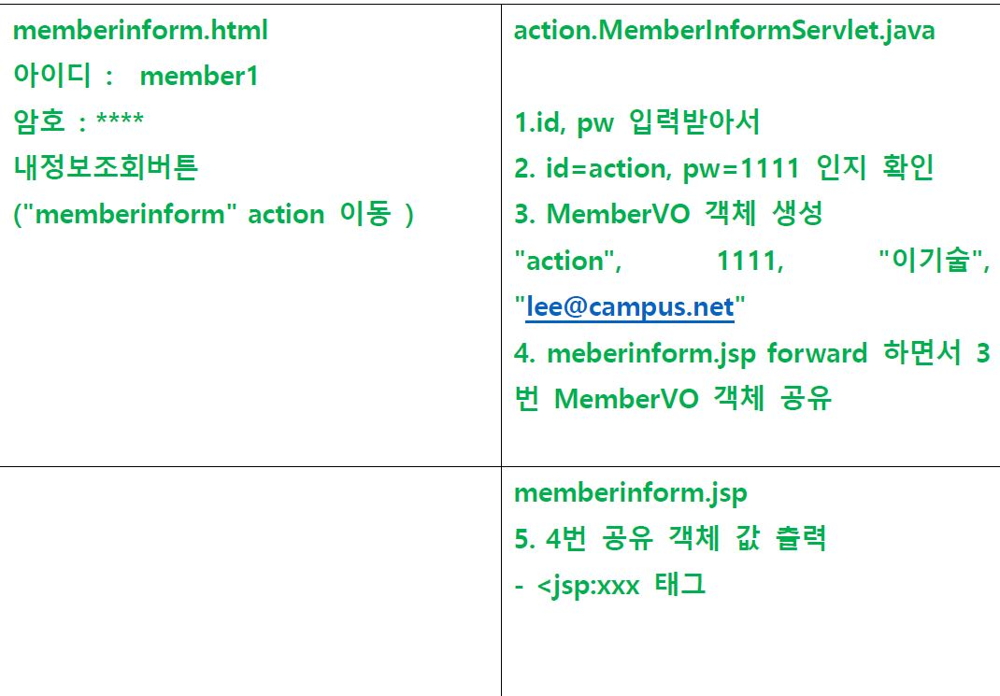
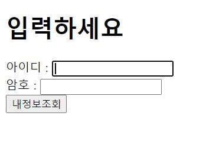
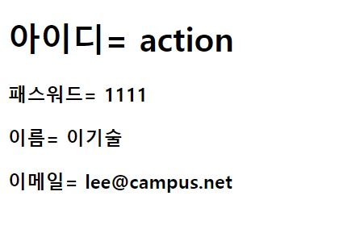

# 객체공유실습 (java , jsp 혼합)

### 문제



## inform.html

```javascript
<!DOCTYPE html>
<html>
<head>
<meta charset="UTF-8">
<title>Insert title here</title>

</head>
<body>
 <form action="memberinform" method=get>
 <!-- '/'를 사용하면 서버루트, 안쓰면 현재파일 기준으로 불러온다 -->
<h1> 입력하세요</h1>
아이디 : <input type=text name="memberid" > <br>
암호 : <input type=password name="password" > <br>

 <input type="submit" value= "내정보조회">  
</form>

</body>
</html>

```



> * form action="memberinform" method=get 에서 같은디렉토리 jsptest에서 "/memberinform"
>
>   인 Servlet 찾아온다 
>
> * html파일은 WebContent 아니면 404 에러 발생


##  action.MemberInformServlet.java

```javascript
package action;

import java.io.IOException;
import java.io.PrintWriter;

import javax.servlet.RequestDispatcher;
import javax.servlet.ServletException;
import javax.servlet.annotation.WebServlet;
import javax.servlet.http.HttpServlet;
import javax.servlet.http.HttpServletRequest;
import javax.servlet.http.HttpServletResponse;

import vo.MemberVO;

@WebServlet("/memberinform")
public class MemberInformServlet extends HttpServlet {

	protected void doGet(HttpServletRequest req, HttpServletResponse resp) throws ServletException, IOException {
		String id = req.getParameter("memberid");
		String password = req.getParameter("password");
		if(id.equals("action") && password.equals("1111")) {
			//if(id=="action" && password=="1111"	) {
			MemberVO vo = new MemberVO();
			vo.setMemberid(id);
			vo.setPassword(Integer.parseInt(password));
			vo.setMembername("이기술");
			vo.setEmail("lee@campus.net");
			req.setAttribute("vo", vo); //res.setAttribute 가 밑에 rd.forward req, resp 로 "vo",vo 를 전달한다
			//<jsp:useBean id="vo" class="vo.MemberVO"<- 패키지 이름vo 까지 씀 scope="request"
			
			RequestDispatcher rd = req.getRequestDispatcher("memberinform.jsp");
			rd.forward(req,resp);
			
		} else {
			//id나 암호 입력이 올바르지 않습니다.
			resp.setContentType("text/html;charset=utf-8");
			PrintWriter o = resp.getWriter();
			o.println("<h3>id나 암호 입력이 올바르지 않습니다.</h3>");
		}
		
		
		//내가한거
		
		/*
		 * request.setCharacterEncoding("utf-8"); 
		 * request.getParameter("memberid"); 
		 * request.getParameter("password");
		 * 
		 * if(memberid.equals("action") && password.equals("1111") ) {
		 * //if(memberid=="action" && password=="1111" ) {
		  
		 MemberVO vo = new MemberVO(); 
		 vo.setMemberid("action");
		 vo.setPassword(Integer.parseInt("1111"));
         vo.setMembername("이기술");
		 vo.setEmail("lee@campus.net");
		 * 
		 * }
		 * 
		 * RequestDispatcher rd = request.getRequestDispatcher("/memberinform.jsp");
		 * rd.forward(request, response);
		 */
	}

}

```

#### id: action pw:1111 일때



#### 그 외


> * html 에서 입력받은 parameter 를 String id, password 객체로 선언한다.
>
> * if(id.equals("action") && password.equals("1111")){}  ==  if(id=="action" && password=="1111"
>
>   구문으로 특정값에서만 출력되는 메소드를 생성한다.
>
> * MemberVO 생성자를 불러와 새로운 객체를 생성한다.
>
> * ### req.setAttribute("vo", vo);   RequestDispatcher에 들어갈 name과 object를 저장한다!
>
> * RequestDispatcher rd 객체를 생성하여 memberinform.jsp로 전달하는 구문을 작성하고,
>
>   rd객체를 forward로 위에 setAttribute로 저장된 ("vo", vo) 를 (req,resp) 로 전달한다.
>
> * id, pw 값이 다를 경우를 else 구문으로 만들어  
>
>   * resp.setContentType("text/html;charset=utf-8"); 로 한글 인코딩이 되게 한뒤, 
>   * PrintWriter 로 화면에 출력할 수 있도록 o 객체 생성
>   * o.println으로 false 일경우의 출력값을 작성한다.


## memberinform.jsp

```javascript
<%@ page language="java" contentType="text/html; charset=UTF-8"
    pageEncoding="UTF-8"%>
<!DOCTYPE html>
<html>
<head>
<meta charset="UTF-8">
<title>Insert title here</title>
</head>
<body>
<!--1. 서블릿으로부터 이동하면서 전달 객체 표현  --> 
 <jsp:useBean id="vo" class="vo.MemberVO" scope="request" />
 <h1>아이디= <jsp:getProperty property="memberid" name="vo"  /> </h1>
<h3>패스워드= <jsp:getProperty property="password" name="vo" /></h3>
<h3>이름= <jsp:getProperty property="membername" name="vo" /></h3>
<h3>이메일=  <jsp:getProperty property="email" name="vo"  /></h3>
</body>
</html>
```

> * Servlet 으로부터 전달받은 내용을 jsp액션태그를 통해 화면에 출력되게 한다.
> * property값이 MemberVO 생성자의 value와 동일한 이름이면 뒤의 value를 생략해도 된다.
> * jsp:getProperty 는 따로 출력구문이 없어도 화면에 출력하는 기능도 포함되어 있다.


## 어려웠던점

> * req.setAttribute()를 따로 지정하지 않아 데이터가 jsp로 넘어가지 않았다. 데이터를 forward나 include로 보낼때 항상 setAttribute를 사용하는걸 잊으면 안되겠다.
> * RequestDispatcher 도 if 구문에포함되어 있어야 정상 작동된다. 밖에 있어서 계속 에러/ null값 출력
> * Servlet(jsp) 에서 출력할 내용이 필요할 경우 response.setContentType("text/html;charset")
>


## 학습한 것 

> * RequestDispatcher를 통해 include/forward를 사용할 경우 
>
> * ####  req.setAttribute("name","object")를 통해 RequestDispatcher 객체인 
>
>   #### rd.include|forward(req,resp) 에 정보를 전달한다!
>   
> * Servlet(jsp) 에서 출력할 내용이 필요할 경우
>
>   * resp.setContentType("text/html;charset=utf-8");
>   * PrintWriter o = resp.getWriter();
>   * o.println = "  ~~~";
>   * 을 통해 화면에 출력한다.
>
> 
>
> 